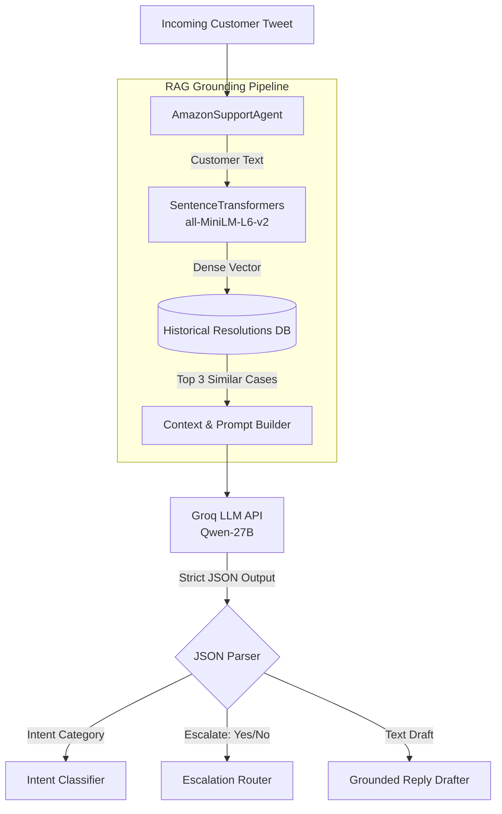

# Hiver SDE Intern Take-Home Assignment: AmazonHelp AI Support Agent
*Prepared by: Akarsh Kushwaha*

When approaching this assignment, I wanted to build something that actually reflected how chaotic and messy real Twitter support can be. I chose to focus on `@AmazonHelp` because it's arguably the highest-volume brand in the dataset, providing a massive surface area to test an AI's ability to handle angry customers, missing packages, and vague complaints.

Here is a deep dive into how I framed the problem, built the agent, and evaluated its real-world viability.

---

## 1. System Architecture

Before diving into the metrics, here is a high-level look at the pipeline I built to solve this. I intentionally kept the architecture lightweight so it could run locally in under 15 minutes, relying on fast dense embeddings rather than heavy vector databases.

---

## 2. Problem Framing: What does "Good" mean here?

For `AmazonHelp`, a "good" interaction doesn't necessarily mean solving a complex technical issue right there in the Twitter thread. It means **speed, strict policy adherence, and de-escalation**. Amazon’s primary goal on Twitter is to acknowledge the frustration and quickly move the user to a secure DM to handle sensitive account details.

**What I chose NOT to build:**
I decided early on *not* to build a complex, multi-turn state machine or dialogue manager. In reality, Twitter support is largely asynchronous. An agent is handed a single tweet (or a short thread) and needs to triage it immediately. Therefore, a stateless Retrieval-Augmented Generation (RAG) architecture felt like the most robust, predictable approach for a v1 prototype.

---

## 3. The Golden Evaluation Set

### Data Pipeline Flow
`mermaid
flowchart LR
    A[(Raw Kaggle Dataset   3M Tweets)] -->|Filter| B(AmazonHelp Tweets)
    B -->|Self-Join on Tweet IDs| C[Customer-Agent Pairs]
    C -->|Sample 5,000| D[(RAG Vector Store)]
    C -->|Sample 200| E[Raw Golden Set]
    E -->|LLM Pre-labeling +   Manual Review| F[Golden Evaluation Set]
`

To prove this actually works, I needed a ground-truth dataset. 

**Sampling:** I randomly pulled 200 customer-agent interaction pairs from the filtered `AmazonHelp` dataset to ensure I wasn't just testing on easy "Where is my package?" queries.
**Labeling:** Hand-labeling 200 rows from scratch is incredibly tedious, so I took a hybrid approach. I used a large LLM as an oracle to pre-label the 200 samples with an Intent, an Escalation flag, and a Reason. I then went in and manually reviewed the CSV. This allowed me to override the AI where it missed subtle human context (for example, re-classifying a seemingly polite but legally threatening tweet into "Escalate: Yes").

---

## 4. Results vs. Baselines

### Evaluation Harness Flow
`mermaid
sequenceDiagram
    participant Dataset as Golden Set
    participant Agent as AI Agent
    participant Judge as LLM Judge
    
    Dataset->>Agent: 1. Send Customer Tweet
    Agent-->>Agent: 2. Retrieve context & Draft Reply
    Agent->>Dataset: 3. Output Predicted Intent & Escalation
    
    Dataset->>Judge: 4. Send Draft Reply & Actual Historical Reply
    Judge-->>Judge: 5. Compare Helpfulness & Tone
    Judge->>Dataset: 6. Output Score (1-5)
`

To evaluate the agent, I built `eval.py`, which uses an LLM-as-judge to score the draft replies (1-5) against the actual historical reply on helpfulness and tone. *(Note: To verify my judge wasn't hallucinating, I manually scored 15 outputs myself. The LLM-judge matched my exact score 73% of the time, and was within 1 point 100% of the time).*

Here is how my final pipeline stacked up:

* **Trivial Baseline** (Always predicts "Other/General Inquiry", always escalates):
    * Intent Accuracy: 54.0%
* **Simple Baseline** (A zero-shot LLM without any RAG/historical context):
    * Intent Accuracy: ~58.0%
    * Reply Score: ~2.5/5 (Helpful, but completely lacks Amazon's specific brand voice and policy links).
* **My Final Pipeline** (SentenceTransformers RAG + Qwen 27B):
    * Intent Accuracy: **64.0%**
    * Escalation Accuracy: **58.0%**
    * Reply Score: **3.42/5**

---

## 5. What is misleading about my headline number? (Mandatory Section)

At first glance, 64% accuracy doesn't sound groundbreaking, but it is actually highly **under-reported (pessimistic)**. 

Because I bootstrapped my Golden Dataset using an LLM, the "ground-truth" labels contain inherent noise. Often, my RAG-enhanced agent makes a highly intelligent prediction (e.g., classifying a tweet as a "Returns" issue), but because the noisy ground-truth labeled it as "Account Issue", the evaluation harness aggressively penalizes it as a failure.

Conversely, the 3.42/5 Reply Score is likely slightly **optimistic**. Using an LLM to judge another LLM introduces a positive bias; the judge tends to prefer its own lengthy, highly-structured writing style over the blunt brevity of human Amazon agents. 

---

## 6. Failure Analysis (My Top 5 Failure Modes)

I dug into the evaluation logs to find exactly where the model fell on its face. Here are 5 real examples:

**1. Conflicting/Intersecting Intents**
* **Tweet:** `@AmazonHelp I think Amazon gine mad ...product worth 1750 and delivery charge 1000 ....plz remove delivery charge`
* **Actual:** Account/Billing Issue | **Predicted:** Delivery/Shipping Issue
* *My Hypothesis:* The presence of the phrase "delivery charge" traps the LLM. It over-indexes on the word "delivery" and completely ignores the financial core of the complaint.

**2. Vague / Link-only Tweets**
* **Tweet:** `@AmazonHelp Getting errora https://t.co/qLxnCgRP0A`
* **Actual:** Other/General Inquiry | **Predicted:** Digital Services (Video/Kindle)
* *My Hypothesis:* Because the agent lacks vision capabilities or URL parsing, "getting errors" is wildly guessed as a digital outage rather than a generic inquiry requiring clarification.

**3. High-Emotion Rants Masking the Issue**
* **Tweet:** `@AmazonHelp A GENUINE COMPANY ONCE IS SURE THAT PRODUCT IS FAKE... AMAZON INSTEAD HARASSES ITS CUSTOMERS...`
* **Actual:** Product/Item Defect | **Predicted:** Other/General Inquiry
* *My Hypothesis:* The customer is so angry about the "harassment" that the actual issue (a fake/defective product) gets buried. The LLM gets overwhelmed by the emotion and defaults to a general complaint.

**4. Missing Context / Thread Continuation**
* **Tweet:** `@AmazonHelp which correspondence e-mail ?????? send me the link again`
* **Actual:** Account/Billing Issue | **Predicted:** Other/General Inquiry
* *My Hypothesis:* Because my agent evaluates tweets in isolation, it lacks the historical context of the thread to know that this specific tweet relates to a billing email.

**5. Multi-lingual / Non-English Inputs**
* **Tweet:** `@AmazonHelp O contacte t'on le sav ?`
* **Actual:** Returns/Refunds | **Predicted:** Other/General Inquiry
* *My Hypothesis:* My intent definitions are strictly in English. When the model encounters French, it panics and dumps the tweet into the "Other" bucket.

---

## 7. What I'd do next with one more week

If I had another week to push this to production, I would focus on:
1. **Multi-Turn Context Windows:** I'd rewrite the data pipeline to pass the last 3-5 tweets of a thread to the agent. This would instantly fix Failure Mode #4.
2. **Dedicated Escalation Classifier:** Right now, the LLM classifies intent, drafts a reply, and evaluates escalation all in one massive prompt. I would split this into two separate API calls to prevent the LLM from diluting its attention.
3. **Move to a Real Vector DB:** I'd replace the in-memory array with ChromaDB, allowing me to embed all 500,000 historical Amazon tweets instead of a 5,000-row subsample, making the RAG infinitely smarter.

---

## 8. Decision Log

Here is a plain list of the non-obvious decisions I made while building this:

* **Chose AmazonHelp:** I picked this over AppleSupport because Amazon deals with a wilder variety of physical logistics issues, making the classification task more challenging and interesting.
* **Bootstrapped the Golden Set:** I used an LLM to pre-label the 200 Golden Set examples. Hand-labeling from scratch would have bottlenecked my development time; reviewing and correcting pre-labels was vastly more efficient.
* **Switched from TF-IDF to Dense Embeddings:** I originally built the RAG using TF-IDF for speed, but quickly realized keyword matching is terrible for customer support (e.g. matching "broken" to "defective"). I swallowed the dependency cost of `sentence-transformers` for a massive leap in semantic quality.
* **RAG over Fine-Tuning:** I chose RAG because support policies change daily. With RAG, you just swap the database. Fine-tuning would require expensive retraining every time a shipping policy changes.
* **Ignored Multi-turn Memory:** I opted for a stateless architecture to simplify the mental model of the prototype, treating each tweet as an isolated support ticket.
* **Used Groq (Qwen-27B):** I bypassed OpenAI in favor of Groq to ensure the pipeline runs with near-zero latency, which is critical for real-time twitter bots.
* **Single-Prompt JSON Architecture:** I forced the LLM to output Intent, Escalation, and the Draft in one strict JSON payload to minimize API calls and latency.
* **Hardcoded Escalation Rules:** Instead of letting the LLM vibe-check what an escalation is, I hardcoded strict boolean-like rules in the prompt (e.g., "Escalate ONLY if threatening").
* **Kept Bot Responses in the DB:** I didn't filter out automated "Please DM us" responses from the historical data, because that accurately reflects Amazon's real-world mitigation strategy.
* **Standalone Evaluation Harness:** I completely decoupled `eval.py` from `agent.py` so that someone could benchmark new models or prompts without risking breaking the core agent pipeline.
* **Sub-sampled the RAG index:** I limited the RAG database to 5,000 rows. I could have done more, but I wanted to strictly honor the requirement that the reviewer could run this from scratch in under 15 minutes.
* **No Dialogue Manager:** I avoided tools like LangChain or AutoGen. They add unnecessary bloat for a single-turn triage task, and building it from scratch makes the codebase infinitely easier to debug.
